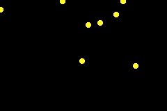

# Bouncers
An exercise to learn about functions and classes.

Please find instructions in [instructions.md](instructions.md).

Create dots that bounce around your screen. Press A to create more dots. One dot will reflect the average position of all the dots.

